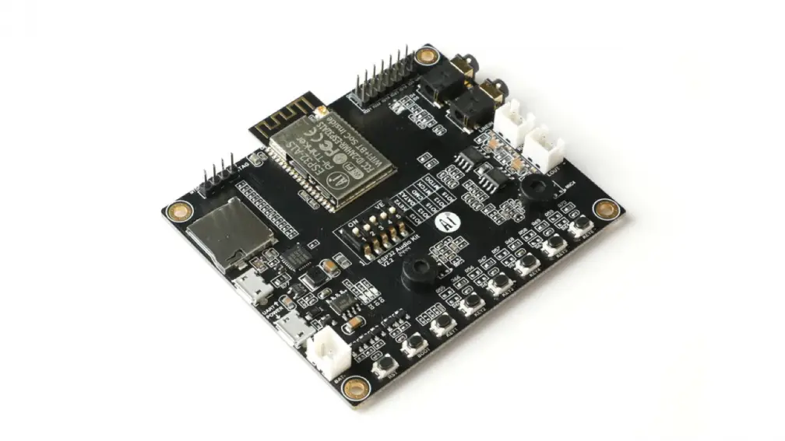

# Elektronik-Spass with Monsieur Fisgus and Mister Paul

1. install "esp32 by Espressif Systems" (v2.0.17) via `Tools > Board: "…" > Board Manager…` ( note, that this is NOT the most recent version )
2. select board at `Tools > Board > ESP32 Arduino > ESP32 Dev Module`
3. select serial port at `Tools > Port: "…"` e.g `cu.usbserial-0001`
4. run example `File > Examples > 01.Basics > Blink` ( define `LED_BUILTIN` as pin `22` with `#define LED_BUILTIN 22` )
5. install libraries:
    - [Arduino Audio Tools](https://github.com/pschatzmann/arduino-audio-tools) (v0.9.8)
    - [Arduino Audio Driver](https://github.com/pschatzmann/arduino-audio-driver) (v0.1.0)
    - [Mozzi](https://github.com/sensorium/Mozzi) (v2.0.1)
6. run example `File > Examples > audio-tools > examples-dsp > examples-mozzi > control_gain`
7. see [ESP32-Audio-kit Documentation](https://docs.ai-thinker.com/en/esp32-audio-kit) for more details

*ESP-32 Audio Kit 2.2 with ESP32-A1S MCU incl. ES8388 Audio Codec*
