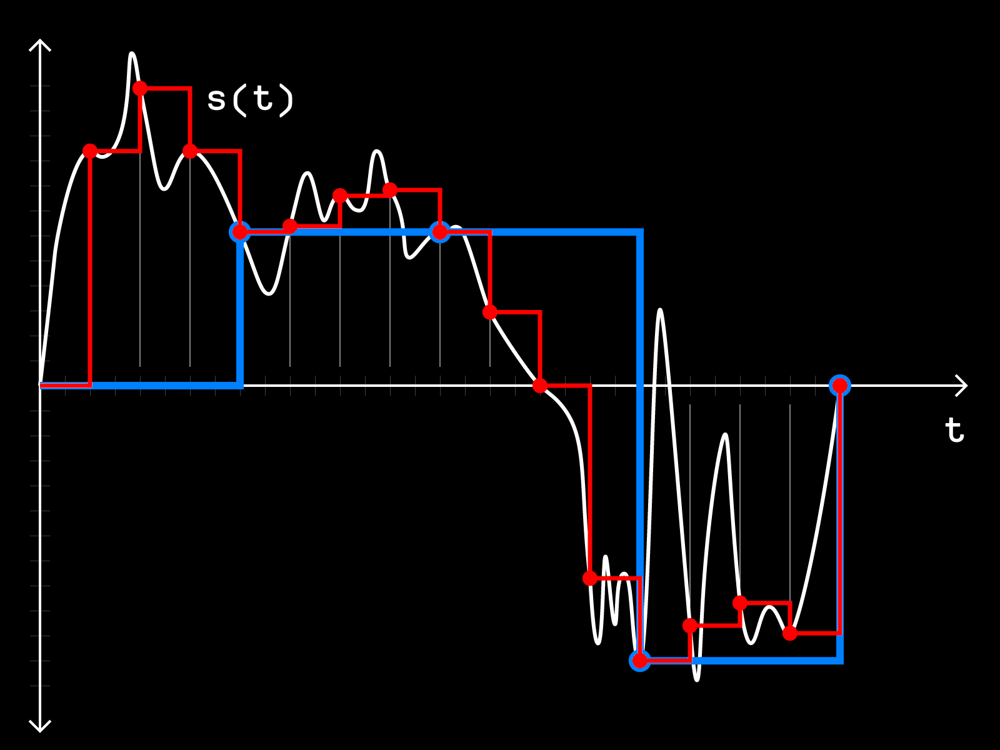
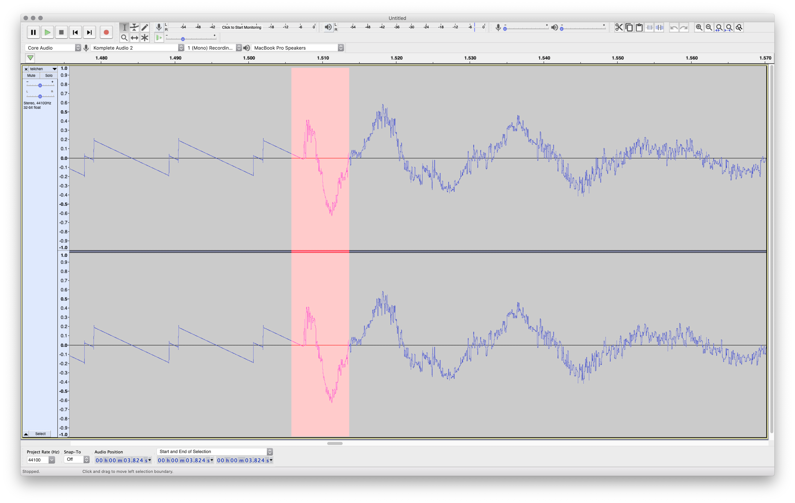
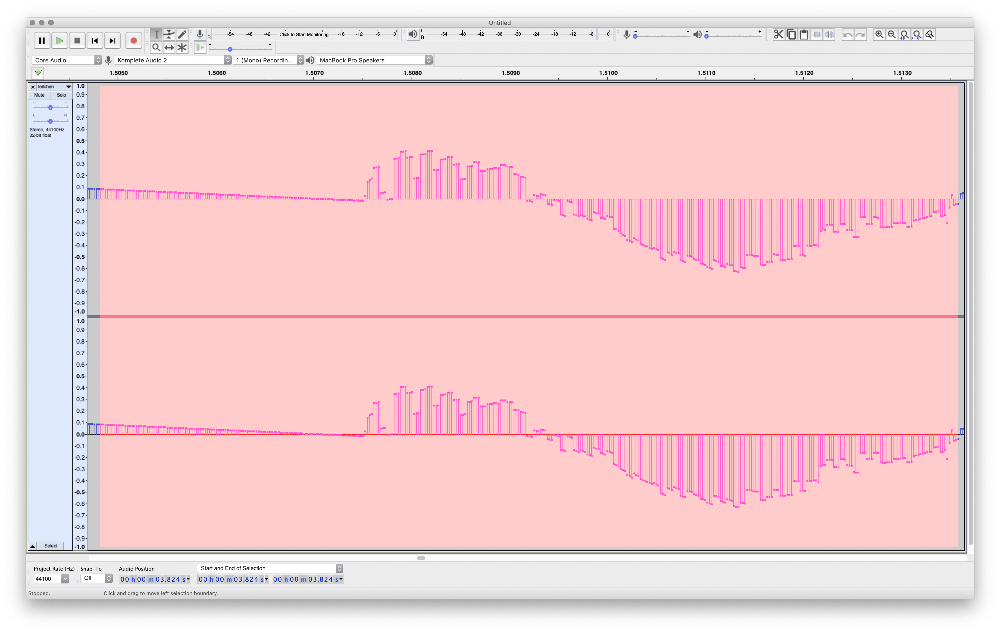
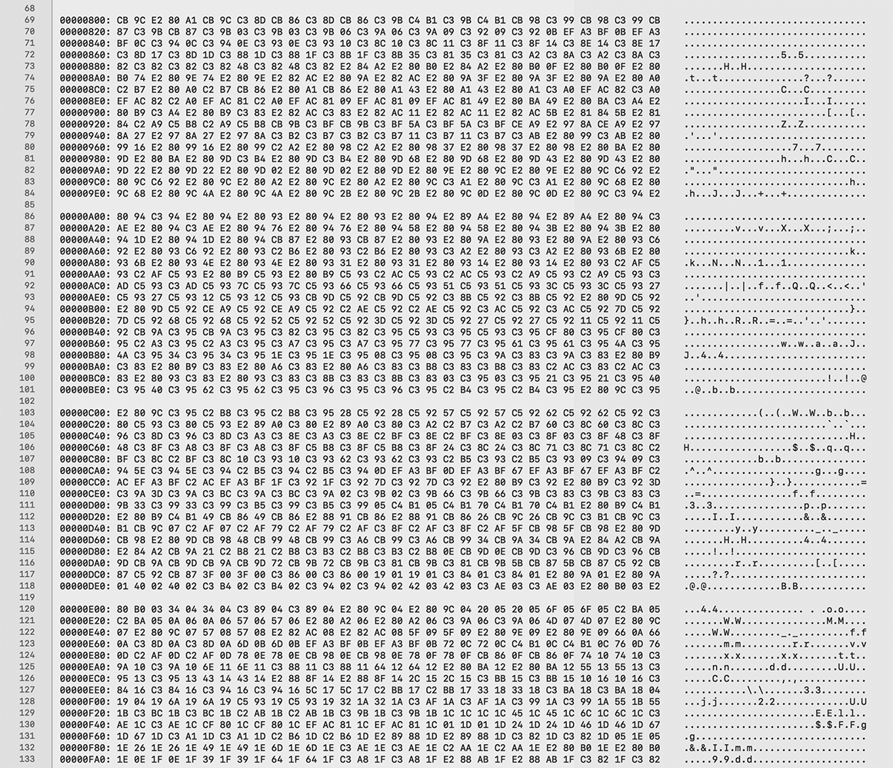
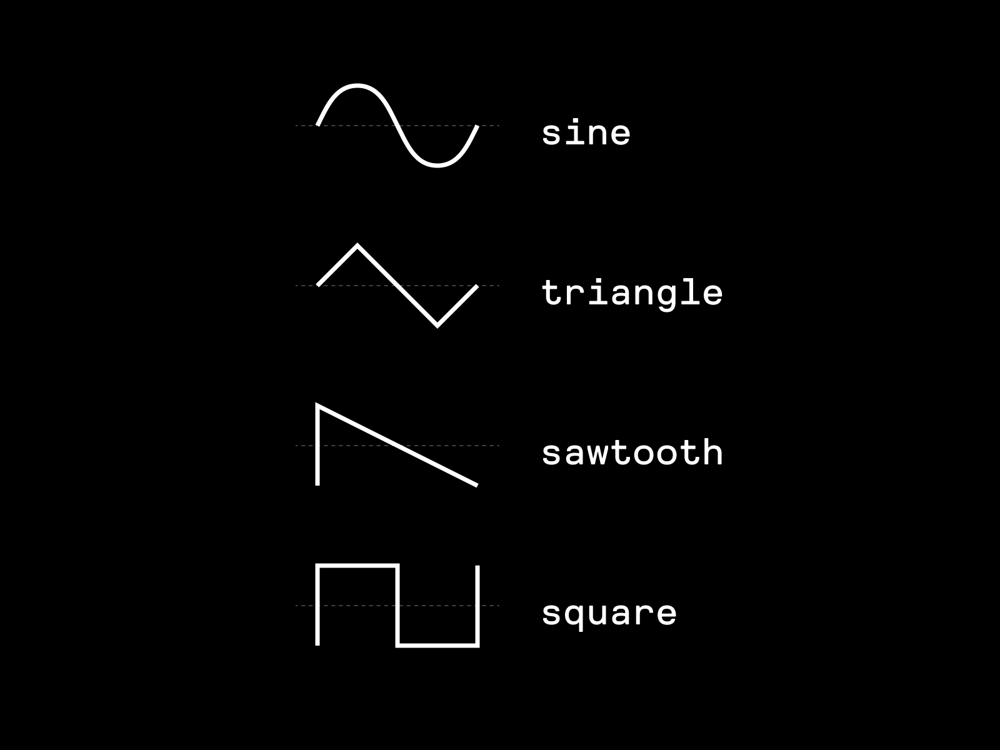
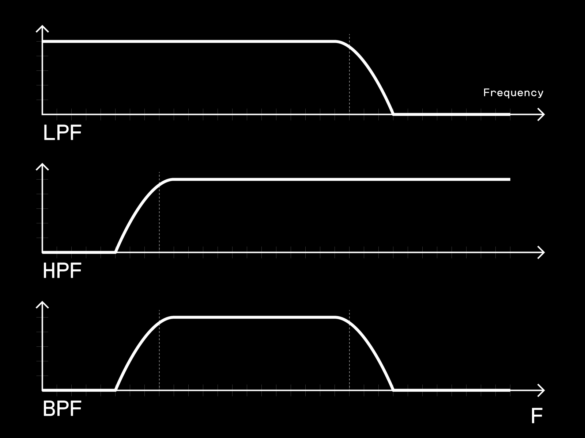
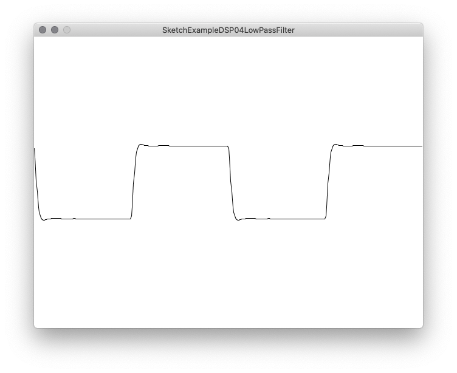
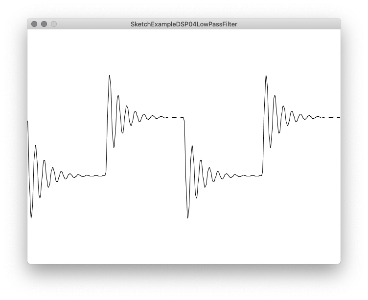
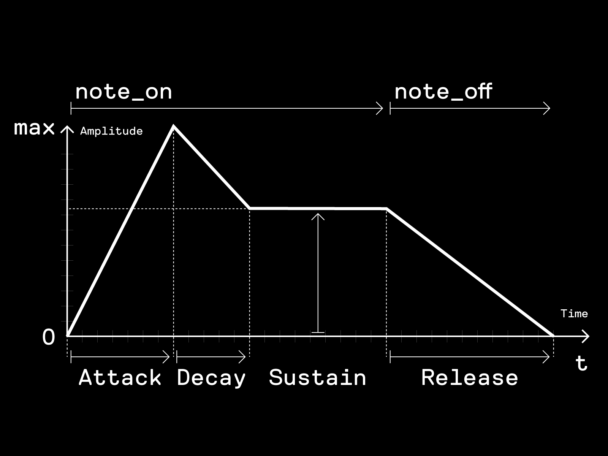

# \--------------------------------------------------
# Digital Music Workshop / 00 / Digital Sound Basics   
# \--------------------------------------------------

---

# \--------------------------------------------------
# Digital Music Workshop / 00 / Digital Sound Basics   
# \--------------------------------------------------

- samples
- audio processing + synthesis
- programming audio

---

## \-------
## samples
## \-------

transforming a continous signal into a sequence of discrete numbers.

---

---

## \-------
## samples
## \-------

samples viewed in [Audacity](https://www.audacityteam.org/)

---

---

---

## \-------
## samples
## \-------

HEX dump of WAV file 16 bits ( = 2 bytes ) per sample

---

---

## \-------
## samples
## \-------

- common sample rate + sample depth
    - 44.100Hz, 16bit ( CD quality ) 
    - 48.000Hz, 24bit ( more *recent* digital system )
- common sample value range: `FLOAT(-1.0, 1.0)`
- Digital-Analog Converters (DAC) convert samples into analog audio signals
- Analog-Digital Converters (ADC) convert analog audio signals into samples

---

## \----------------------------
## audio processing + synthesis
## \----------------------------

- oscillators
- filters
- envelopes
- effects
- analysis

---

### \----------
### oscillator 
### \----------

oscillator repeatingly create signals at specific frequencies. oscillators are destinguished by the *waveforms* they produce.

the most common waveforms or -shapes are:

- sine
- triangle
- sawtooth
- square

---

---

### \----------
### oscillator
### \----------

- in reference to their electronic origins oscillators are sometimes still refered to as *Voltage-Controlled Oscillators* (VCO).
- oscillators that oscillate at low frequencies ( < 20Hz ) are refered to as *Low Frequency Oscillators* (LFO).
- *wavetables* are pieces of memory containing waveforms ( or other sample data ). in audioprogramming wavetables are sometimes used to implement oscillators.
- *oscilloscopes* are used to visualize signals.
- @example(`ExampleDSP05Wavetable`)

---

### \-------
### filters
### \-------

filters are processes that remove unwanted components or features ( often frequencies ) from a signals.

the most common filters are:

- Low Pass Filter (LPF)
- High Pass Filter (HPF)
- Band Pass Filter (BPF)

---

---

### \-------
### filters
### \-------

- in reference to their electronic origins filters are still sometimes refered to as *Voltage-Controlled Filters* (VCF)
- 2 common paramters in filters are 
    - *CutOff Frequency*
    - *Resonance* ( `Q` or quality factor )
- @example(`ExampleDSP04LowPassFilter`)

---

---

### \---------
### envelopes
### \---------

envelopes describe parameter changes over time.

the most common envelope is the *Attack-Decay-Sustain-Release envelope* ( ADSR ).

---

---

### \---------
### envelopes
### \---------

- [ADSR envelope synth tutorial part A](https://youtu.be/A6pp6OMU5r8)
- [ADSR envelope synth tutorial part B](https://youtu.be/9niampRkFW0)
- @example(`ExampleInstruments01ADSR`)
- note that envelopes can be applied to other paramters as well e.g filter or effect values.

---

### \-------
### effects
### \-------

- delay/echo
- reverb
- chorus
- @example(`ExampleDSP03Echo`)

---

### \--------
### analysis
### \--------

- Peak Follower
- Beat Detection
- Fast Fourier Transformation (FFT) ( for an explanation on FFT see [3Blue1Brown: But what is the Fourier Transform? A visual introduction.](https://youtu.be/spUNpyF58BY) )

---

### \-------
### summary
### \-------

- [Subtractive Synthesis](https://en.wikipedia.org/wiki/Subtractive_synthesis) ( + [Additive Synthesis](https://en.wikipedia.org/wiki/Additive_synthesis) )
- [Digital Signal Processing](https://en.wikipedia.org/wiki/Digital_signal_processing) (DSP)
- analog + digital [Modular Synthesizer](https://en.wikipedia.org/wiki/Modular_synthesizer) ( see also [Eurorack](https://en.wikipedia.org/wiki/Eurorack) )
- @REF([Curtis Roads: The Computer Music Tutorial](https://mitpress.mit.edu/books/computer-music-tutorial))
- @REF([Music DSP](https://www.musicdsp.org))

---

## \-----------------
## programming audio
## \-----------------

- visual ( nodes + flow ) versus text-based ( block )
- visual
    - Max
    - Pure Data
- text-based
    - SuperCollider
    - Csound
    - Processing.org ( Libraries )

<!-- @todo(add screenshots from applications e.g MAX + Csound) -->

---

### \------------------
### audio applications
### \------------------

an incomplete list of some common audio applications:

- Max @visualprogramming
- Pure Data @visualprogramming
- SuperCollider @text-based
- Csound @text-based
- Abelton Live @DAW
- Logic Pro / GarageBand @DAW
- REAPER @DAW
- Bitwig Studio @DAW
- VCV Rack @modularsynthsimulator
- Audacity @audio-editor
- ocenaudio @audio-editor

---

### \---
### Ton
### \---

[Ton](https://github.com/dennisppaul/ton) a framework for exploring and teaching generative music making and algorithmic compositions. it facilitates simple ways of playing musical notes, facilitates easy access to low-level digital signal processing (DSP) and supplies rhythm and timing as well as some standard muscial mechanics. the library acts as a simple adapter to various sound in- and outputs like JSyn, MIDI, OSC, or analog audio.

---

### \---
### Ton
### \---

- `Ton` playing notes
- `DSP` processing sound
- `Beat` creating rhythm
 